# ess-compartilhamento-de-reviews

## Descrição
Projeto para disciplina de engenharia de software e sistemas com intuito de cobrir algumas features de usuário comum de um aplicativo de compartilhamento de reviews.

## Tecnologias utilizadas

### Back-end
1. Node.js
2. Express.js
3. MongoDB
4. Mongoose
5. JWT
6. Jest
7. SuperTest

### Front-end
1. React.js
2. React-Router-Dom
3. Axios
4. SweetAlert.js
5. React-spinners
6. Jest
7. React-testing-library

### BDD
1. Cucumber
2. Selenium
3. Chai

## Cenários do BDD
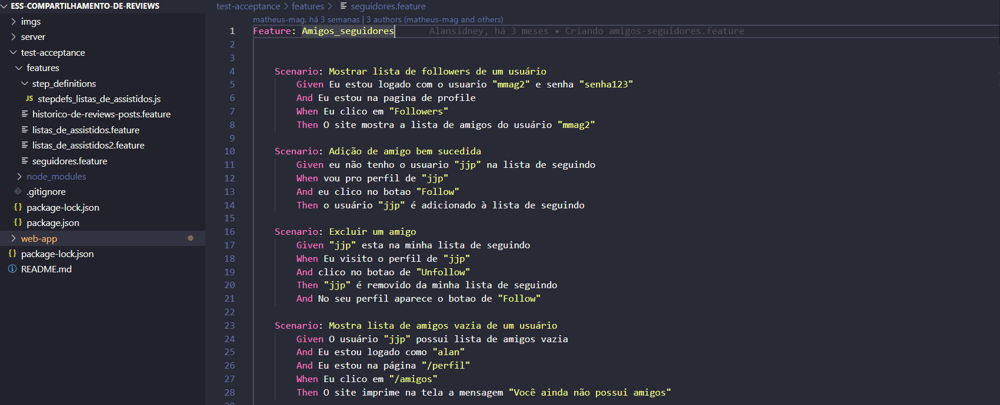

## Features

### Home page
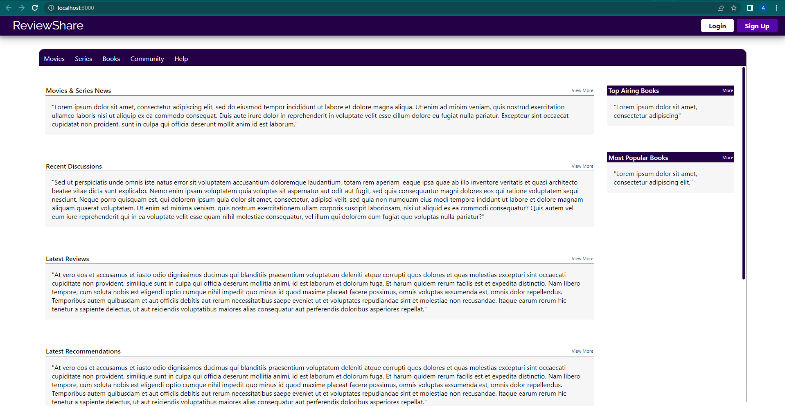
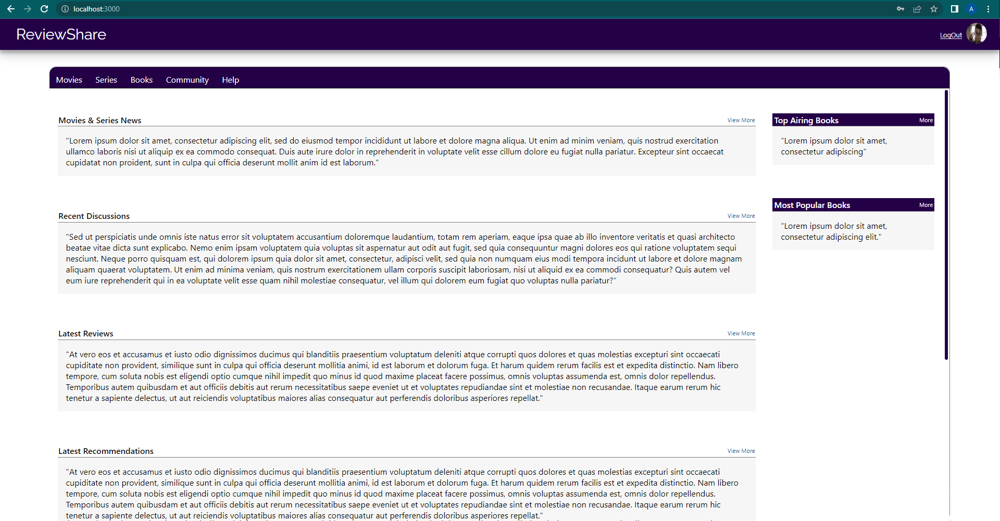

### Sign up
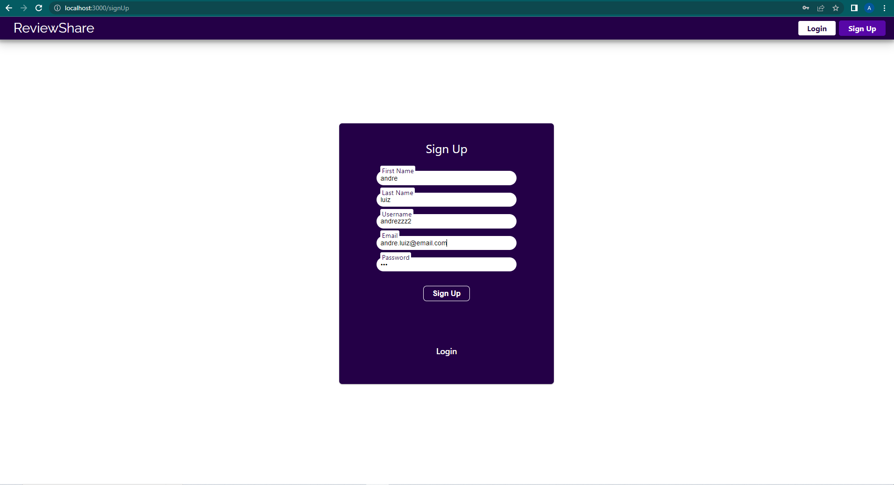
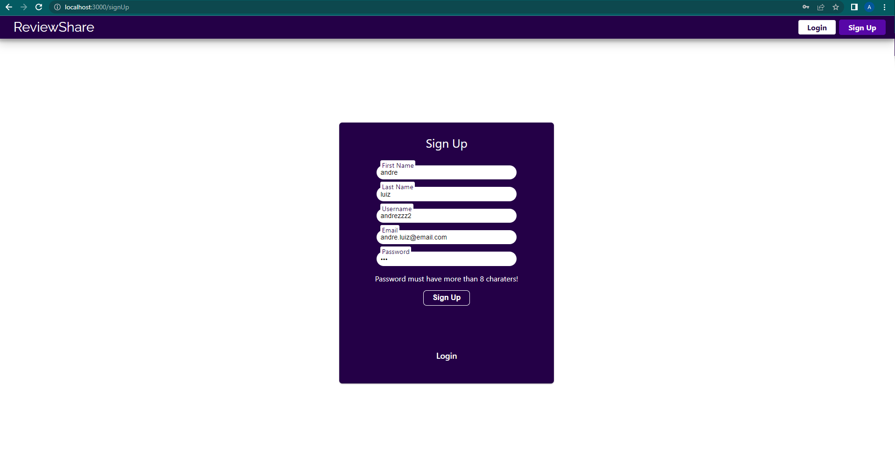


### Login
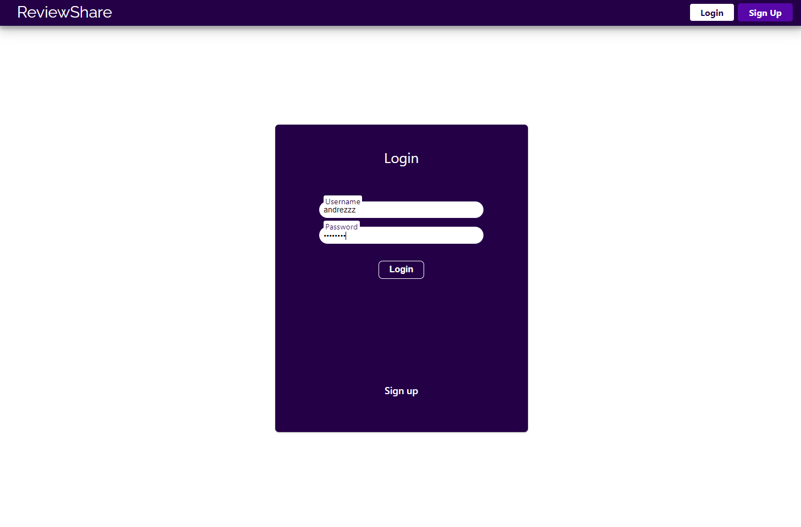

### Lists
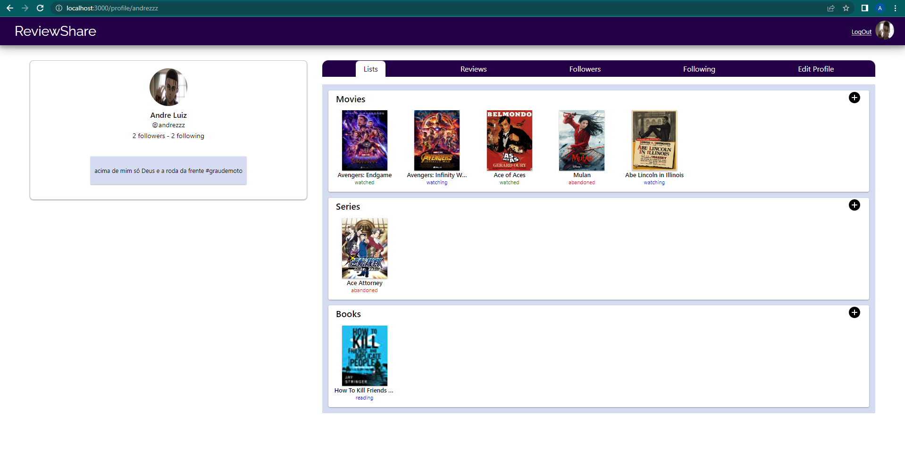
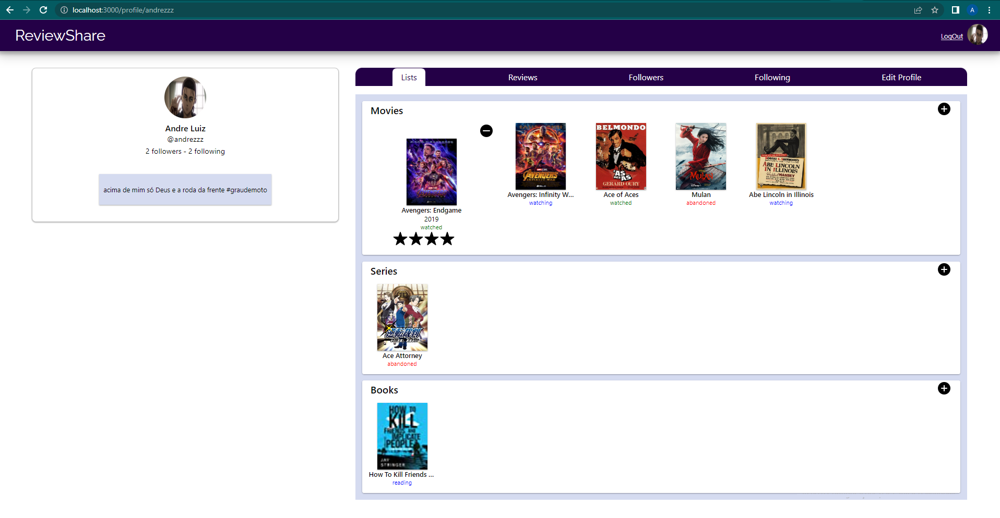
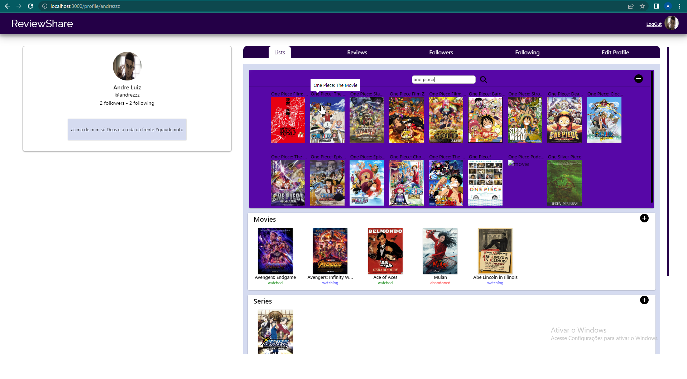

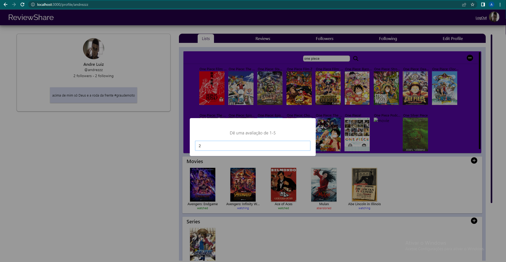
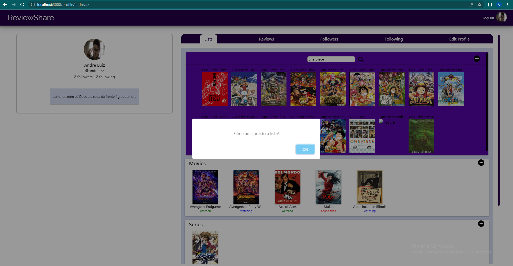
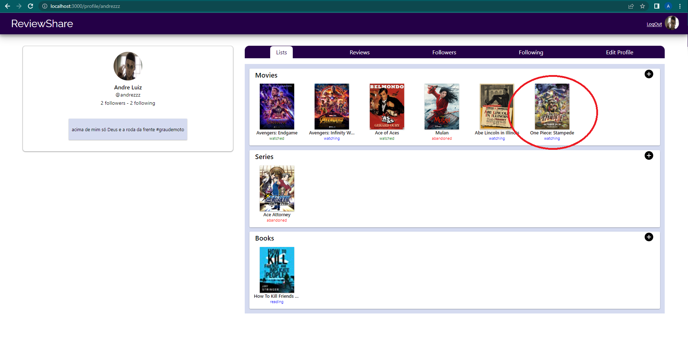

### Followers/Following
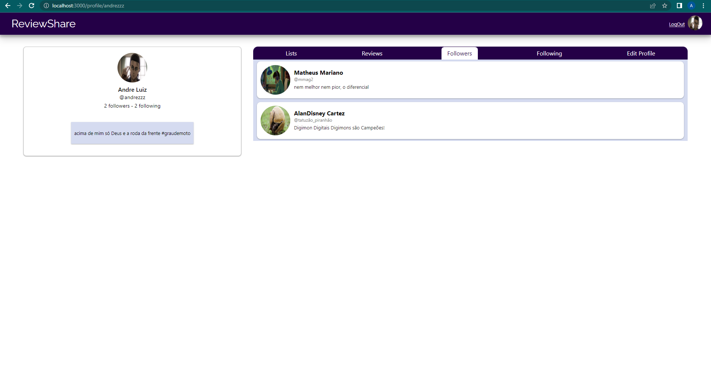
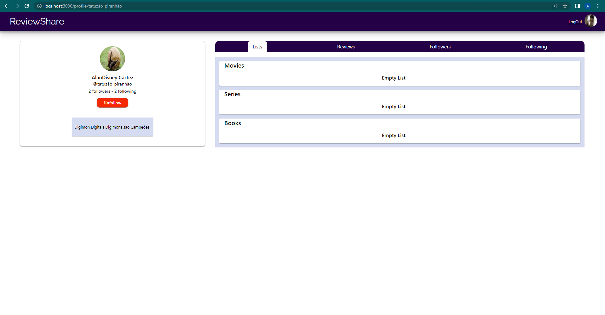

### Edit profile
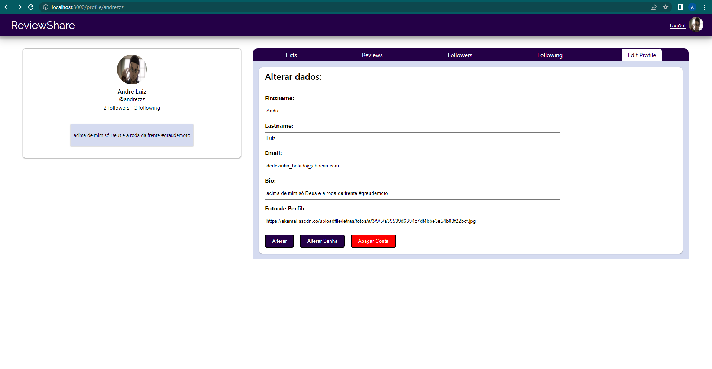


## Iniciando server

1. Entre na pasta server
```
cd server
```

2. Instale as dependências usando
ou
```
npm install
```

3. Inicie o server usando
```
npm start
```

## Iniciando o web app

1. Entre na pasta web-app
```
cd server
```

2. Instale as dependências usando
```
npm install
```

3. Inicie o server usando
```
npm start
```

## Testes de GUI no Front-end

1. A partir da raiz, entre na pasta web-app
```
cd web-app
```
2. Rode os testes com
```
npm test
```
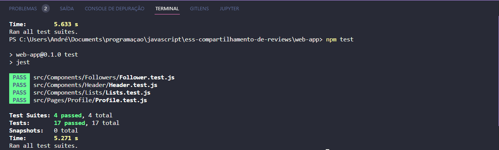

## Testes unitários e de integração no Back-end

1. A partir da raiz, entre na pasta server
```
cd server
```
2. Rode os testes com
```
npm test
```
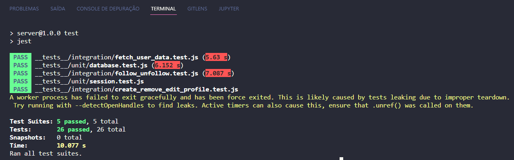


## Testes end-to-end

1. Inicie o server e o web app

2. Entre na pasta test-acceptance usando
```
cd test-acceptance
```

3. Instale as depêndencias usando
```
npm install
```

4. Inicie os teste com
```
npm test
```
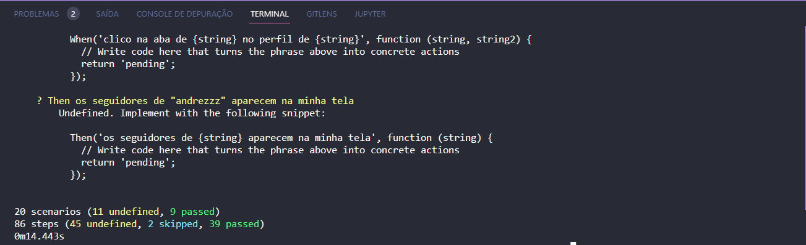


